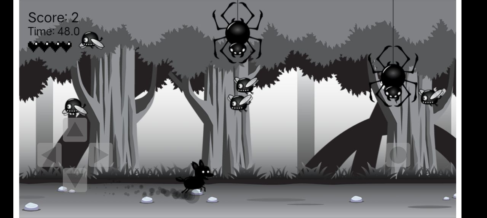

### Introduction
RollingDog is a simple android 2D game
### Demo

### How to play
- Use arrow buttons on the left to control the dog's movements
- Use the "Roll" button on the right to let dog roll
#### game rules:
(1) One round has 60 seconds time, with 5 hearts
(2) When your dog hit a monster while walking, it will lose a heart. If it hit a monster while rolling, you can get 1 score. 
(3) When the dog lost all hearts, or time is up, game is over.

### Device Requirements
API >= 26
### Todos
Main game was written in JavaScript and runs in a WebView which is low-performance.
We'll rewrite the game to use Android graphics.
### Credit
The original JavaScript code and assets are from FreeCodeCamp.org

